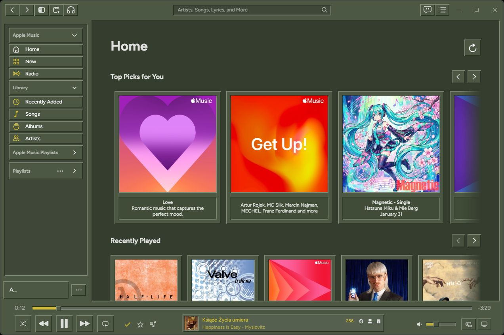
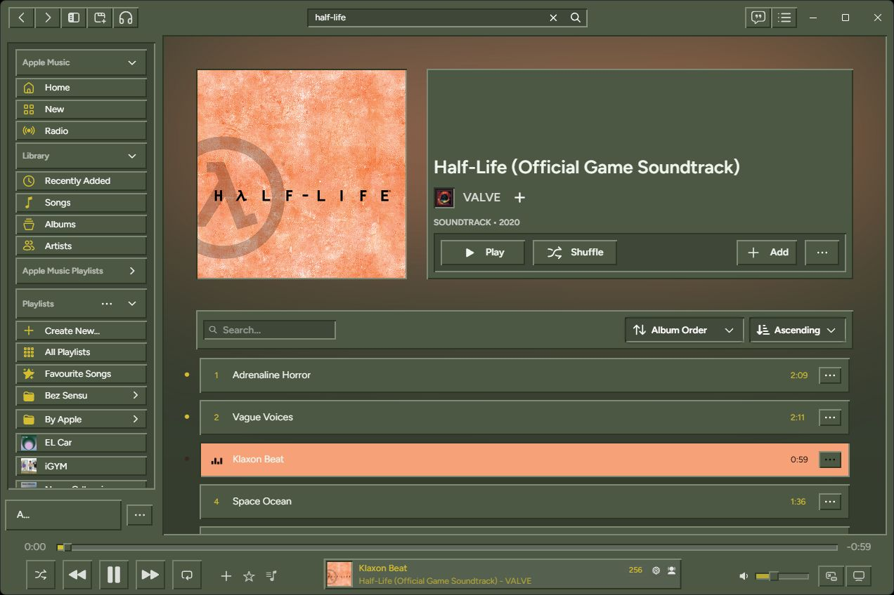
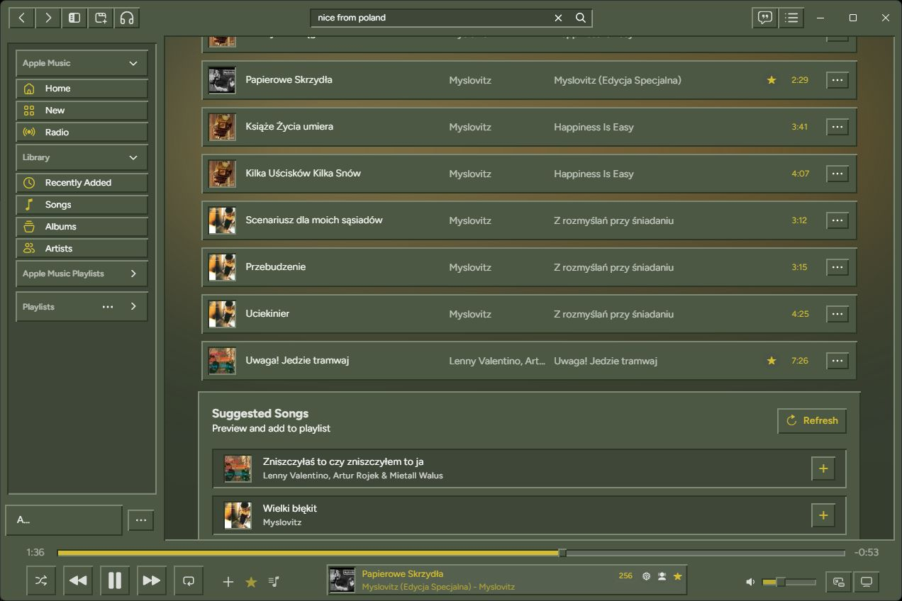
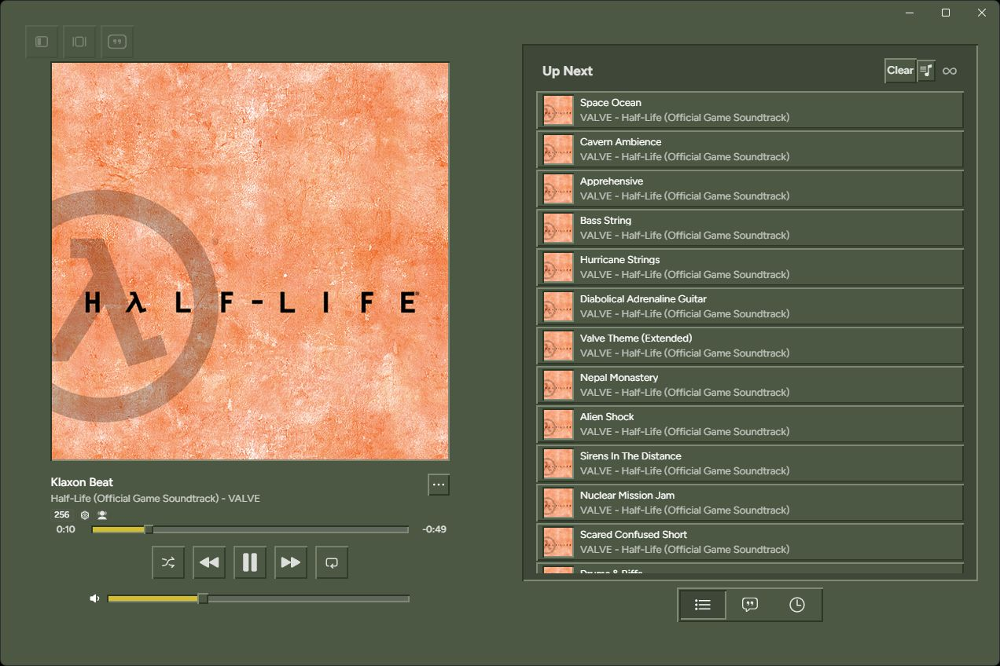
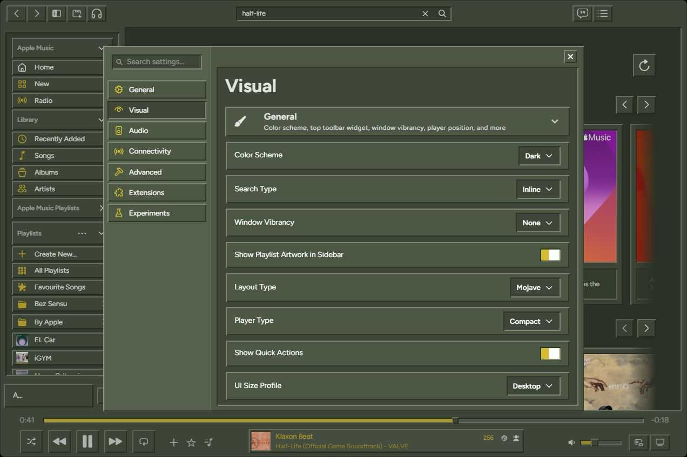

# goldCDR

## Description
Imagine if [Cider](https://cider.sh/) was made in GoldSRC
This theme is Cider theme inspired by the old GoldSRC aesthetics (like Half-Life or CS 1.6)
## Installation
### Marketplace
Go to options, Extensions then Themes and there you can press "Get More Themes" in order to find it on the official Cider Marketplace.
### Manual
**WINDOWS**
Download the zip create a directory with a number as it name and put it to the:
`%appdata%\sh.cider.dotnet\themes`
for example you can do:
`%appdata%\sh.cider.dotnet\themes\3`

## Recommended settings
Those are recommended settings for best experience other ones might be better supported in future.
### Visual
#### General
    - Window Vibrancy: None
    - Layout Type: Mojave
    - Player Type: Compact
    - UI Size Profile: Desktop
#### Color Customization
    - Use Immersive Background: OFF
#### Content Preferences
    - Use Editorial Layout: OFF
### Advanced
#### Tweaks
##### Progress Bar
    - iOS Style: OFF

## Screenshots

## Annotation
I Believe HLX